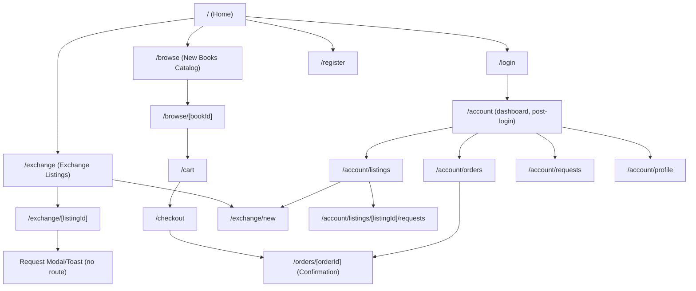

# Site Map & Information Architecture — BookSwap
### Phase 1 — Design & Architecture

Builds directly on `Requirements.md`

---

## 1. Visual Site Map



---

## 2. Page Inventory

Every page a user can land on, with route, access level, and purpose.

| # | Route | Page Name | Access | Purpose |
|---|---|---|---|---|
| 1 | `/` | Home | Public | Hero, value prop, featured books (mix of new + exchange), entry points to Browse/Exchange. Already scaffolded. |
| 2 | `/browse` | Catalog | Public | Paginated/scrollable grid of new books, search + filter. |
| 3 | `/browse/[bookId]` | Book Detail | Public | Full book info, "Add to Cart" (auth-gated action). |
| 4 | `/cart` | Cart | Logged-in | Line items, quantities, subtotal, "Checkout" CTA. |
| 5 | `/checkout` | Checkout | Logged-in | Mock payment form, order summary, "Place Order." |
| 6 | `/orders/[orderId]` | Order Confirmation | Logged-in (owner only) | Confirmation details after checkout; also viewable later from order history. |
| 7 | `/exchange` | Exchange Listings | Public | Grid/list of open exchange listings, search + filter by condition/genre. |
| 8 | `/exchange/[listingId]` | Listing Detail | Public | Full listing info, photo, "Request Exchange" (auth-gated action). |
| 9 | `/exchange/new` | Create Listing | Logged-in | Form: title, author, condition, description, photo upload (Cloudinary), wanted-in-return note. |
| 10 | `/login` | Login | Public (redirects if already logged in) | NextAuth sign-in form. |
| 11 | `/register` | Register | Public | Account creation form. |
| 12 | `/account` | Account Dashboard | Logged-in | Landing page after login; links out to Orders, Listings, Requests, Profile. |
| 13 | `/account/orders` | Order History | Logged-in | List of past orders, links to each `/orders/[orderId]`. |
| 14 | `/account/listings` | My Listings | Logged-in | Exchange listings the user created, with status (open/pending/closed), edit/delete. |
| 15 | `/account/listings/[listingId]/requests` | Incoming Requests | Logged-in (owner only) | Requests received on one of the user's listings — Accept/Decline actions. |
| 16 | `/account/requests` | My Sent Requests | Logged-in | Exchange requests the user has sent to others, with status. |
| 17 | `/account/profile` | Profile | Logged-in | Name/email/avatar edit. |
| — | 404 | Not Found | Public | Default Next.js not-found page, lightly styled to match brand. |


---

## 3. Navigation Structure

### 3.1 Primary header nav (all pages, per existing `page.js` scaffold)
```
📚 BookSwap   |   Home   Browse   Exchange   [Cart icon]   [Login / Account ▾]
```
- **Logged out:** far right shows `Login` (and `Register` reachable from the login page, not duplicated in the nav to keep it uncluttered).
- **Logged in:** far right becomes an `Account ▾` dropdown → Dashboard, My Orders, My Listings, My Requests, Profile, Logout. Cart icon shows item count badge.

### 3.2 Footer (all pages)
```
BookSwap — built as a student project
[About/Team — optional]   [GitHub repo link — optional]
```
Kept minimal; this is an academic project, not a real storefront needing a large footer sitemap.

### 3.3 Mobile nav
Header collapses to a hamburger menu containing the same items as desktop nav (Home, Browse, Exchange, Cart, Account/Login). Cart badge stays visible outside the hamburger since it's a high-frequency action.

### 3.4 Contextual/in-page navigation
- **Book Detail → Cart:** "Add to Cart" keeps user on the page (toast confirmation), doesn't force navigation — reduces friction for continued browsing.
- **Listing Detail → Request sent:** same pattern — inline confirmation, not a page redirect.
- **Account Dashboard:** acts as a hub page linking to all four `/account/*` sub-pages; also directly reachable via header dropdown so the dashboard itself is optional friction, not a bottleneck.

---

## 4. URL / Folder Structure (App Router mapping)

```
app/
  page.js                              → /
  browse/
    page.js                            → /browse
    [bookId]/page.js                   → /browse/:bookId
  exchange/
    page.js                            → /exchange
    new/page.js                        → /exchange/new
    [listingId]/page.js                → /exchange/:listingId
  cart/page.js                         → /cart
  checkout/page.js                     → /checkout
  orders/
    [orderId]/page.js                  → /orders/:orderId
  login/page.js                        → /login
  register/page.js                     → /register
  account/
    page.js                            → /account
    orders/page.js                     → /account/orders
    requests/page.js                   → /account/requests
    profile/page.js                    → /account/profile
    listings/
      page.js                          → /account/listings
      [listingId]/requests/page.js     → /account/listings/:listingId/requests
  components/
    BookCard.js                        (already built — reused on Home, Browse, Exchange)
    ListingCard.js                     (new — Exchange-side equivalent, mirrors BookCard pattern)
    Header.js / Footer.js              (extract from page.js once a 2nd page exists, avoid duplication)
  api/
    books/route.js                     → GET/POST /api/books
    books/[bookId]/route.js            → GET /api/books/:bookId
    orders/route.js                    → POST /api/orders (checkout)
    orders/[orderId]/route.js          → GET /api/orders/:orderId
    listings/route.js                  → GET/POST /api/listings
    listings/[listingId]/route.js      → GET/PATCH/DELETE /api/listings/:listingId
    listings/[listingId]/requests/route.js → GET/POST requests for a listing
    requests/[requestId]/route.js      → PATCH (accept/decline)
    auth/[...nextauth]/route.js        (NextAuth handler)
```

This gives each developer a literal folder checklist: the user builds everything under `browse/`, `cart/`, `checkout/`, `orders/`; the friend builds everything under `exchange/`, plus the listings/requests pieces of `account/` and `api/`.

---

## 5. Core User Flows

### 5.1 Buy flow
```
Home / Browse → Book Detail → (if not logged in → Login → back to Book Detail)
→ Add to Cart → Cart → Checkout → Order Confirmation → (later) Account → Order History
```

### 5.2 Exchange flow (requester side)
```
Home / Exchange → Listing Detail → (if not logged in → Login → back to Listing Detail)
→ Request Exchange → Account → My Requests (track status)
```

### 5.3 Exchange flow (owner side)
```
Account → My Listings → Create Listing (or view existing)
→ Incoming Requests (per listing) → Accept or Decline
→ [on Accept] Listing status becomes "closed", requester notified via status change on their My Requests page
```

### 5.4 Auth flow
```
Any auth-gated action while logged out → redirect to /login with a return-path
→ successful login → redirect back to the original page (not always /account)
```
This "return to where you were" pattern avoids dropping users back at a generic dashboard when they were mid-task (e.g., about to request an exchange).

---

## 6. Content Hierarchy per Key Page (wireframe-ready outline)

### Home (`/`)
1. Header/nav
2. Hero (headline + subtext, already built)
3. Featured Books section (mix of new + exchange `BookCard`s)
4. Footer

### Browse (`/browse`)
1. Header/nav
2. Page title + search bar + filter controls (genre/price)
3. Book grid (`BookCard` × N, paginated)
4. Footer

### Book Detail (`/browse/[bookId]`)
1. Header/nav
2. Breadcrumb (Home > Browse > Title)
3. Cover image, title, author, price, description
4. "Add to Cart" CTA
5. Footer

### Exchange Listings (`/exchange`)
Same structure as Browse, using `ListingCard` instead of `BookCard`, plus a prominent "List Your Book" CTA.

### Account Dashboard (`/account`)
1. Header/nav
2. Welcome + user name
3. Four summary cards (Orders, Listings, Requests, Profile) each linking to its full page
